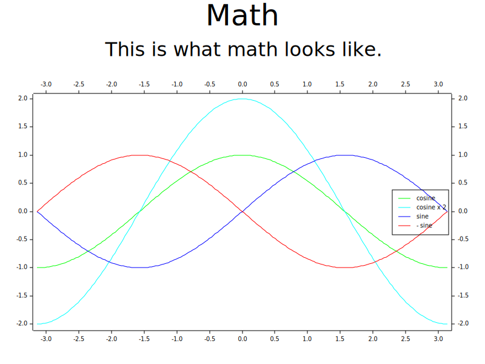

# Roc platform for drawing plots with Plotters

[Roc](https://roc-lang.org/)
+
[Plotters](https://github.com/38/plotters)
= <3



## How to example

1. Set up a Roc environment

    ```sh
    nix-shell ./roc/shell.nix
    ```

1. Build Roc

    ```sh
    ./scripts/for-roc/build.sh
    ```

1. Build & run an example

    ```sh
    ./scripts/for-examples/build_and_run.sh hello_world
    ```
