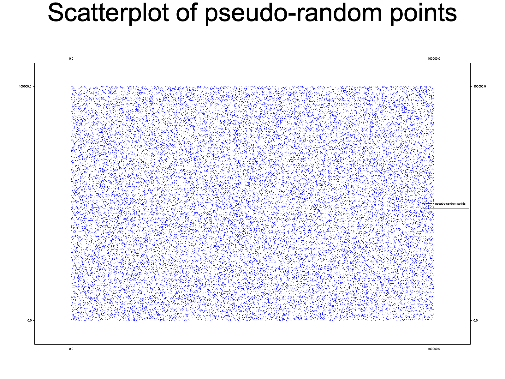

# Roc platform for drawing with Plotters

[Roc](https://roc-lang.org/)
+
[Plotters](https://github.com/38/plotters)
= <3




## How to use

1. [Install Roc & Rust](https://github.com/roc-lang/roc/tree/main/getting_started)

1. Run one of [the examples](https://github.com/JanCVanB/roc-plotters/tree/main/examples)

    ```sh
    roc ./examples/hello_world.roc
    ```

1. Open [the output image](https://github.com/JanCVanB/roc-plotters/blob/main/examples/hello_world.png)

1. Write your own Roc script(s) and enjoy!

1. [Open an issue](https://github.com/JanCVanB/roc-plotters/issues/new) if you encounter any problems or have any ideas for improvement, and [create a PR](https://github.com/JanCVanB/roc-plotters/compare) if you want to help improve this for others!
