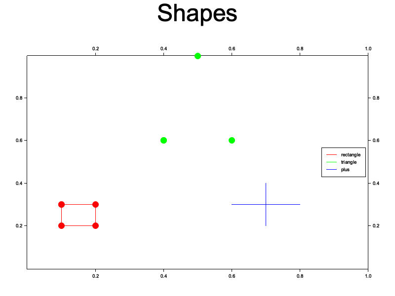

# Roc platform for drawing with Plotters

[Roc](https://roc-lang.org/)
+
[Plotters](https://github.com/38/plotters)
= <3





## How to example

1. In flake.nix, change `path:/home/anton/gitrepos/roc-plotters/roc` to your roc path (this will be fixed in the near future)
1. Set up a Roc environment

    ```sh
    nix develop ./roc
    ```

1. Build Roc

    ```sh
    ./scripts/for-roc/build.sh
    ```

1. Build & run an example

    ```sh
    ./scripts/for-examples/build_and_run.sh hello_world
    ```
